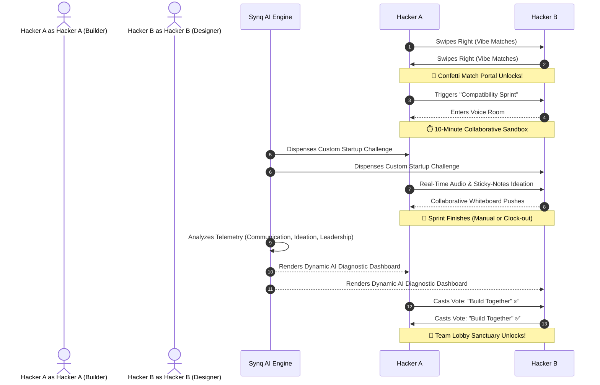
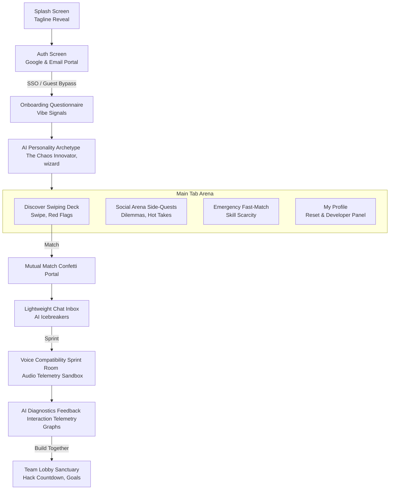

# Synq — AI-Powered Compatibility Platform for Hackathon Teams 🚀

<p align="center">
  
</p>

> **"GitHub matches code. LinkedIn matches resumes. Synq matches people who can actually build together."**

Synq is a premium, mobile-first social matchmaking and collaborative workspace designed specifically for hackathon hackers, builders, startup founders, and designers. 

Rather than matching teammates purely on abstract resume bullet-points, Synq focuses on **behavioral compatibility, process alignment (e.g. ship speed vs. pixel perfection), communication dynamics, and collaborative chemistry.**

---

## ⚡ The Synq Core Innovation: The Compatibility Sprint

While traditional platforms stop at swiping, Synq introduces the **Compatibility Sprint**:



---

## 🎨 Premium Gen-Z Startup Design System
Synq sports a beautiful, high-fidelity dark mode designed to impress at first glance:
* **Dark Violet Aesthetics:** Rich deep slate and dark violet backgrounds (`#06050C`, `#0C0A1A`) combined with glowing borders and sleek glassmorphism cards.
* **Cyber Glow Accents:** Electric violet, neon blue, and hot magenta highlight badges.
* **Interactive Micro-Animations:** Particle confetti on mutual matches, spring-loaded swiping tilt physics, and pulsing voice speak visualizers.

---

## 📱 Visual Application Navigation Map

The entire product navigation tree flows smoothly under a unified React Navigation stack:



---

## 🛠️ Technology Stack & Architecture

* **Core Framework:** React Native (Expo SDK `54.0.0`)
* **State Coordination:** React Context API (`src/context/AppContext.tsx`) serving automated competitor state-machines, chat bots, voice indicators, and telemetry reports.
* **Authentication Platform:** Google SSO integrated with **Firebase Authentication** v10+ utilizing custom secure redirects.
* **Icons:** `lucide-react-native`
* **Gradients:** `expo-linear-gradient`
* **Animation Engine:** Pure JavaScript `Animated` API (fully native-driven, lightweight, and robust across both simulator and native devices).

---

## 🔒 Firebase & Google Proxy Authentication

To enable real, secure Google Sign-In directly inside **Expo Go** (avoiding standard browser `exp://` redirect blocks), Synq implements the secure **Expo Proxy Service**:

```
[ App.tsx ] 
    ──> [ AuthScreen.tsx ]
            ──> Triggers expo-auth-session with scheme 'synq-auth'
            ──> Redirects securely via: https://auth.expo.io/@Pixie-19/Synq
            ──> Receives Google OAuth ID Token
            ──> Exchanges with Firebase: GoogleAuthProvider.credential(idToken)
            ──> Signs user into Firebase Authentication!
```

---

## 📂 File Architecture Map

* `App.tsx` - Root coordinator routing all active screens.
* [src/types/index.ts](file:///c:/Users/RISHITA%20SEAL/OneDrive/Documents/hackathon/Synq/src/types/index.ts) - TypeScript data models and contracts.
* [src/context/AppContext.tsx](file:///c:/Users/RISHITA%20SEAL/OneDrive/Documents/hackathon/Synq/src/context/AppContext.tsx) - Unified application state, matching logic, and chatbot.
* [src/services/firebase.ts](file:///c:/Users/RISHITA%20SEAL/OneDrive/Documents/hackathon/Synq/src/services/firebase.ts) - Resilient initialization of Firebase App and persistence-enabled Auth.
* [src/components/](file:///c:/Users/RISHITA%20SEAL/OneDrive/Documents/hackathon/Synq/src/components) - Reusable visual elements (`GlassCard`, JS `Confetti`).
* [src/screens/](file:///c:/Users/RISHITA%20SEAL/OneDrive/Documents/hackathon/Synq/src/screens) - Individual gorgeous dashboards:
  * [SplashScreen.tsx](file:///c:/Users/RISHITA%20SEAL/OneDrive/Documents/hackathon/Synq/src/screens/SplashScreen.tsx) - Tagline micro-animations.
  * [AuthScreen.tsx](file:///c:/Users/RISHITA%20SEAL/OneDrive/Documents/hackathon/Synq/src/screens/AuthScreen.tsx) - Google Proxy & Email Firebase portal.
  * [OnboardingScreen.tsx](file:///c:/Users/RISHITA%20SEAL/OneDrive/Documents/hackathon/Synq/src/screens/OnboardingScreen.tsx) - Vibe capture (snack, habit, speed scale).
  * [ArchetypeScreen.tsx](file:///c:/Users/RISHITA%20SEAL/OneDrive/Documents/hackathon/Synq/src/screens/ArchetypeScreen.tsx) - AI Personality archetype aura.
  * [DiscoverScreen.tsx](file:///c:/Users/RISHITA%20SEAL/OneDrive/Documents/hackathon/Synq/src/screens/DiscoverScreen.tsx) - Gesture swiping deck with Red Flag visualizers.
  * [SocialArenaScreen.tsx](file:///c:/Users/RISHITA%20SEAL/OneDrive/Documents/hackathon/Synq/src/screens/SocialArenaScreen.tsx) - dilemas, hot takes & custom poll statistics.
  * [EmergencyBuilderScreen.tsx](file:///c:/Users/RISHITA%20SEAL/OneDrive/Documents/hackathon/Synq/src/screens/EmergencyBuilderScreen.tsx) - Open squads needing specialized builders.
  * [MatchScreen.tsx](file:///c:/Users/RISHITA%20SEAL/OneDrive/Documents/hackathon/Synq/src/screens/MatchScreen.tsx) - Celebration card with confetti.
  * [ChatScreen.tsx](file:///c:/Users/RISHITA%20SEAL/OneDrive/Documents/hackathon/Synq/src/screens/ChatScreen.tsx) - Messaging with AI-powered quick icebreakers.
  * [SprintScreen.tsx](file:///c:/Users/RISHITA%20SEAL/OneDrive/Documents/hackathon/Synq/src/screens/SprintScreen.tsx) - Whiteboard ideation & voice speak simulators.
  * [DynamicAnalysisScreen.tsx](file:///c:/Users/RISHITA%20SEAL/OneDrive/Documents/hackathon/Synq/src/screens/DynamicAnalysisScreen.tsx) - Telemetry analytics.
  * [TeamLobbyScreen.tsx](file:///c:/Users/RISHITA%20SEAL/OneDrive/Documents/hackathon/Synq/src/screens/TeamLobbyScreen.tsx) - Squad sanctuary, roadmap, and live status.

---

## 🚀 Running Locally

Ensure you have Node.js installed, then boot the server immediately:

### 1. Install Dependencies
```bash
npm install
```

### 2. Launch Expo Metro Server
```bash
npx expo start --clear
```

### 3. Open in Expo Go
* Scan the QR code displayed in your terminal using your iOS Camera or Android Expo Go app to launch the **Synq** sandbox immediately!
* Press `w` in your terminal to view the platform in your web browser.
