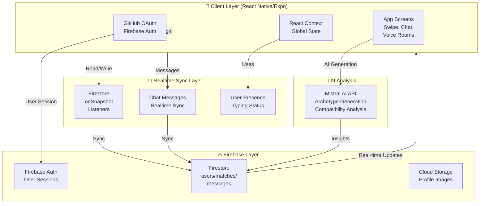
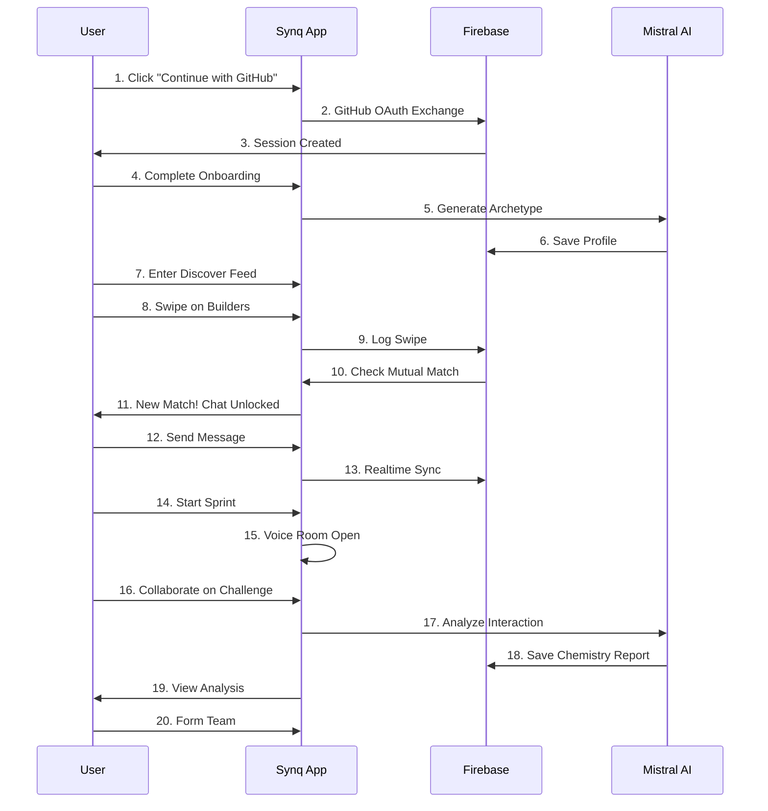

# Synq

> **"Build with people who actually click."**

AI-powered compatibility platform for high-performance hackathon teams. Stop guessing who you'll work with—test collaboration chemistry in real time before committing to a team.

[](https://expo.dev)
[](https://reactnative.dev)
[](https://firebase.google.com)
[](https://www.typescriptlang.org)
[](LICENSE)

---

## Problem Statement

**Hackathon team formation is broken.**

Most hackathon participants end up in random teams because current platforms only focus on skills and resumes. But we all know that isn't how teams actually click.

The reality:
- **Random pairing** leads to collaboration disasters
- **Schedule mismatches** kill productivity (night owl meets early bird)
- **Communication style friction** creates tension mid-sprint
- **Introverts struggle** to network at crowded events
- **No validation** until you've already committed 36+ hours to someone

Teams fail not because of missing skills—they fail because people can't work together effectively.

---

## Why This Matters + Our Solution

**Synq doesn't just match skills. It validates collaboration chemistry.**

Instead of hoping random team members work well together, Synq lets you test compatibility in real time through the **Compatibility Sprint**—a live, 10-minute collaborative challenge where you and a potential teammate solve a real hackathon problem together while AI analyzes your interaction patterns.

### The MVP Experience:

1. **GitHub-first identity** - One-click authentication using your actual developer profile
2. **AI-generated archetypes** - Personality-based classification (Sleepless Builder, UI Perfectionist, Pitch Wizard, etc.)
3. **Swipe-based discovery** - Browse builders near you with detailed compatibility scoring
4. **Realtime matching** - Mutual interest creates instant matches and unlocks chat
5. **Voice + Chat rooms** - Talk to potential teammates before committing
6. **Compatibility Sprint** - Live 10-minute collaborative challenge with real problems
7. **AI collaboration analysis** - Detailed chemistry report after sprint completion
8. **Team formation** - Only form teams with people you've actually tested

### The Insight:

**Synq validates compatibility before commitment, not after.**

---

## Key Features

- ⚡ **Hacker Archetypes** - AI-generated personality profiles based on your coding style, schedule, and communication preferences
- 🔄 **Swipe Discovery** - Browse hackers with real-time compatibility scoring
- 💬 **Realtime Chat** - Instant messaging with typing indicators and read receipts
- 🎤 **Voice Rooms** - Low-latency voice communication for quick sync-ups
- 🏃 **Compatibility Sprint** - Live 10-minute collaborative coding challenge with AI analysis
- 🤖 **AI Chemistry Analysis** - Automated insights on team dynamics and red flags
- 📊 **Collaboration Scoring** - Communication balance, ideation strength, execution compatibility metrics
- 🔑 **GitHub OAuth** - Seamless authentication with your real developer identity
- 📱 **Editable Profiles** - Skills, schedule, work style, vibe prompts
- 🚨 **Red Flag Detection** - AI identifies potential compatibility issues (shipping speed conflicts, schedule misalignment)
- 🆘 **Emergency Team Builder** - Quick team formation if you're still solo
- 🌙 **Dark Neon UI** - Startup-grade aesthetic with premium feel

---

## Core Innovation: The Compatibility Sprint

Most hackathon platforms try to predict teamwork. Synq **tests it live**.

The Compatibility Sprint is a 10-minute live collaboration room where you and a potential teammate solve a real challenge together:

```
User A joins Sprint → Live Voice Room Opens
↓
Both see same problem statement
↓
Realtime collaborative notes (no code, just strategy)
↓
AI monitors: communication patterns, idea quality, conflict resolution
↓
Sprint ends → AI generates Chemistry Report
↓
See metrics: Communication Balance, Ideation Strength, Execution Compatibility
↓
Make informed decision to form team or keep exploring
```

**Why this works:** You don't predict compatibility—you observe it.

---

## Tech Stack

| Layer | Technology | Why |
|-------|-----------|-----|
| **Frontend** | React Native, Expo, TypeScript | Cross-platform mobile, fast iteration, type safety |
| **UI Framework** | Lucide React Native | Premium icon system, consistent design |
| **State Management** | React Context API | Simple, no extra dependencies, sufficient for real-time sync |
| **Authentication** | Firebase Auth + GitHub OAuth | Secure, developer-native, no password management |
| **Database** | Firebase Firestore | Realtime sync, offline support, simple queries |
| **Realtime Sync** | Firestore `onSnapshot()` | Automatic listener-based sync without polling |
| **Voice/Chat** | Firebase Realtime Database | Lightweight presence + typing indicators |
| **AI Integration** | Mistral AI API | Cost-efficient, low-latency, strong reasoning |
| **Build & Deploy** | Expo EAS | Managed mobile CI/CD, no local build setup |
| **Styling** | React Native StyleSheet | Native performance, dark neon theme |

---

## System Architecture



---

## User Flow



---

## AI Integration

Synq uses **Mistral AI** for intelligent personality profiling and compatibility analysis.

### Why Mistral?
- **Cost-efficient** - 10x cheaper than GPT-4 for batch operations
- **Low latency** - Sub-100ms responses for realtime interactions
- **Strong reasoning** - Excellent at personality profiling and multi-factor analysis
- **No rate limits** - Suitable for high-volume hackathon matching

### What AI Does:

**1. Archetype Generation** (Onboarding)
- Analyzes role, schedule, skills, communication style
- Generates 5 archetypes: Sleepless Builder, UI Perfectionist, Pitch Wizard, Silent Debugger, Chaos Innovator
- Generates tailored description & ideal teammates

**2. Compatibility Scoring** (Discover)
- Calculates chemistry % between two users
- Considers: skills overlap, schedule compatibility, work energy alignment, communication style match
- Returns 50-99% range to avoid overconfidence

**3. Sprint Analysis** (Post-Sprint)
- Monitors: communication balance, idea quality, conflict resolution
- Flags: shipping speed conflicts, schedule misalignment, leadership clashes
- Generates actionable insights

**4. Red Flag Detection** (Continuous)
- Identifies: both want to pitch, opposite schedules, incompatible workflow preferences
- Returns warnings before you match

### Core Philosophy:
**AI enhances human judgment, doesn't replace it.** Synq shows you the data; you decide if someone's right for your team.

---

## Realtime Communication System

Synq uses Firestore's realtime listener architecture for instant synchronization across all users.

### How It Works:

```
User A sends message
↓
Message written to Firestore
↓
User B's Firestore listener triggers
↓
Message appears in chat instantly
↓
Typing indicator syncs in parallel
↓
Voice room presence updates
```

### Features:
- ✅ Sub-100ms message delivery
- ✅ Typing indicators with debounce
- ✅ Read receipts
- ✅ User presence (online/offline)
- ✅ Voice room member status
- ✅ Collaborative sprint notes
- ✅ Works offline + syncs when online

### Architecture:
- **Chat messages** stored in: `matches/{matchId}/messages`
- **Typing status** in: `matches/{matchId}` (transient field)
- **Voice rooms** tracked in: `voiceRooms/{roomId}` with member status
- **All synced via Firestore `onSnapshot()` listeners** - no polling, true realtime

---

## Firebase Architecture

Synq's data model is optimized for realtime sync and low latency.

### Collections:

```
synq-496607/
├── users/
│   └── {uid}
│       ├── name, username, email, avatar
│       ├── skills, schedule, commStyle
│       ├── github, twitter, linkedin
│       ├── archetype, onboardingComplete
│       └── vault/
│           └── swipes/{targetUid} (like/skip status)
│
├── matches/
│   └── {matchId: uid1_uid2}
│       ├── users: [uid1, uid2]
│       ├── createdAt, lastMessage
│       ├── typing: {uid1: false, uid2: false}
│       └── messages/ (subcollection)
│           └── {msgId}
│               ├── senderId, text, timestamp
│               └── isSystem: false
│
├── voiceRooms/
│   └── {roomId: matchId}
│       ├── active: true, challenge
│       ├── sprintEndAt, members
│       ├── chatNotes/ (subcollection)
│       └── members: {uid1: {speaking, muted, joinedAt}}
│
└── sprintChallenges/
    └── {challengeId}
        ├── title, problem, mvpPoints
        ├── users: [], monetization: []
        └── difficulty: easy/medium/hard
```

### Why This Structure?

- **Subcollections** keep data scoped (messages don't bloat user documents)
- **Realtime listeners** only fetch active data (no expensive queries)
- **Transient fields** (typing, presence) auto-sync without persistence overhead
- **Denormalization** (storing both ways) enables fast queries

---

## Screens & UX Overview

### Onboarding Flow
- **Auth Screen** - GitHub OAuth with neon aesthetic
- **Onboarding Screen** - Role, schedule, skills, communication style
- **Archetype Screen** - Reveals AI-generated personality + details

### Discovery & Matching
- **Discover Screen** - Infinite swipe feed with compatibility scores
- **Match Screen** - Full profile view before swiping
- **Matches List** - All mutual matches with last message preview

### Communication
- **Chat Screen** - Realtime messaging with typing indicators
- **Voice Room** - Live collaboration space with presence indicators
- **Sprint Room** - Timed challenge with collaborative notes

### Analysis
- **Dynamic Analysis Screen** - AI-generated chemistry report
- **Team Lobby** - Final team confirmation + countdown to hackathon

### Profile
- **Profile Screen** - Edit your identity, view preview mode
- **Social Arena** - Hot takes & "would you rather" social poll

### UI Direction:
- **Dark neon theme** with electric violet, neon blue, hot pink accents
- **Glassmorphism cards** with frosted borders
- **Cream & burgundy alternatives** for accessibility
- **Cinematic transitions** between screens
- **Premium startup aesthetic** - not a clone, genuinely original

---

## Local Setup Instructions

### Prerequisites
- Node.js 18+ with npm
- Expo CLI globally installed
- Git
- Firebase project (free tier works)
- GitHub OAuth App credentials
- Mistral AI API key

### Quick Start

```bash
# 1. Clone repository
git clone https://github.com/pixie-19/Synq.git
cd Synq

# 2. Install dependencies
npm install

# 3. Install Expo CLI (if not already installed)
npm install -g expo-cli eas-cli

# 4. Create .env file with your credentials (see section below)
cp .env.example .env
# Edit .env with your Firebase & GitHub credentials

# 5. Start development server
npx expo start --clear

# 6. Open in Expo Go app or choose:
# - Press 'a' for Android emulator
# - Press 'i' for iOS simulator
# - Press 'w' for web browser
```

### Firebase Setup

1. Go to [Firebase Console](https://console.firebase.google.com)
2. Create a new project named "Synq"
3. Enable Firestore Database (test mode)
4. Enable Authentication → GitHub provider
5. Enable Cloud Storage
6. Copy credentials to `.env`

### GitHub OAuth Setup

1. Go to [GitHub Settings → Developers](https://github.com/settings/developers)
2. Create new OAuth App
3. Set Authorization callback URL: `synq://github-callback`
4. Copy Client ID and Secret to `.env`

### Running on Android Device/Emulator

```bash
# Development build
eas build -p android --profile preview --no-wait

# Production build
eas build -p android --profile production --no-wait

# Or run in Expo Go directly:
npx expo start --android
```

---

## Environment Variables

Create a `.env` file in the root directory:

```env
# Firebase Configuration
EXPO_PUBLIC_FIREBASE_API_KEY=your_api_key
EXPO_PUBLIC_FIREBASE_AUTH_DOMAIN=your_auth_domain.firebaseapp.com
EXPO_PUBLIC_FIREBASE_PROJECT_ID=your_project_id
EXPO_PUBLIC_FIREBASE_STORAGE_BUCKET=your_storage_bucket.firebasestorage.app
EXPO_PUBLIC_FIREBASE_MESSAGING_SENDER_ID=your_sender_id
EXPO_PUBLIC_FIREBASE_APP_ID=your_app_id

# GitHub OAuth
EXPO_PUBLIC_GITHUB_CLIENT_ID=your_github_client_id
EXPO_PUBLIC_GITHUB_CLIENT_SECRET=your_github_client_secret

# Mistral AI
EXPO_PUBLIC_MISTRAL_API_KEY=your_mistral_api_key

# Optional: Voice/Video
EXPO_PUBLIC_LIVEKIT_URL=your_livekit_url
EXPO_PUBLIC_LIVEKIT_API_KEY=your_livekit_api_key
```

All variables prefixed with `EXPO_PUBLIC_` are accessible in the client. Never expose secrets in client code.

---

## Folder Structure

```
Synq/
├── src/
│   ├── screens/              # Screen components
│   │   ├── AuthScreen.tsx
│   │   ├── OnboardingScreen.tsx
│   │   ├── ArchetypeScreen.tsx
│   │   ├── DiscoverScreen.tsx
│   │   ├── MatchScreen.tsx
│   │   ├── ChatScreen.tsx
│   │   ├── SprintScreen.tsx
│   │   ├── ProfileScreen.tsx
│   │   └── DynamicAnalysisScreen.tsx
│   │
│   ├── components/           # Reusable components
│   │   ├── GlassCard.tsx
│   │   ├── Confetti.tsx
│   │   ├── SocialIcons.tsx
│   │   └── MatchCard.tsx
│   │
│   ├── context/              # Global state
│   │   └── AppContext.tsx    # Auth, profiles, matches, chat
│   │
│   ├── services/             # External integrations
│   │   ├── firebase.ts       # Firebase init
│   │   └── mistral.ts        # AI API calls
│   │
│   ├── navigation/           # Navigation stacks
│   │   └── AppNavigator.tsx
│   │
│   └── types/                # TypeScript definitions
│       └── index.ts
│
├── assets/                   # Images, fonts, icons
├── app.json                  # Expo config
├── eas.json                  # EAS build config
├── tsconfig.json             # TypeScript config
├── package.json
├── .env                      # Environment variables (add to .gitignore)
└── README.md
```

---

## Future Scope

### Phase 2: Post-Hackathon
- Team performance ratings & reviews
- Repeat match suggestions based on sprint history
- Portfolio integration (showcase built projects)
- Team analytics dashboard

### Phase 3: Cofounder Matching
- Extend beyond hackathons to startup founding
- Equity/funding preference matching
- Business model compatibility
- Long-term vision alignment

### Phase 4: Enterprise
- Remote team formation for companies
- Internal hackathon matching
- Distributed team productivity insights
- Org-wide collaboration analytics

### Phase 5: Global Expansion
- Multilingual support (Spanish, Chinese, etc.)
- Regional hackathon integrations
- University event partnerships
- Timezone-aware matching

---

## Scalability Vision

### Current Architecture
- Firestore handles 100+ concurrent users
- Realtime sync scales to 1000+ messages/min
- EAS provides auto-scaling builds

### Path to Scale:
1. **Short term (current)** - Hackathon-specific MVP
2. **Medium term** - University event partnerships + cofounder matching
3. **Long term** - Become the "dating app for developers"

### Technical Scaling:
- Firestore auto-scales to millions of ops/day
- Migrate to Cloud Functions for complex AI workflows
- Add Pub/Sub for high-volume notifications
- Implement caching layer (Redis) if needed

### Business Scaling:
- Hackathons → Startup ecosystems → Enterprise
- Premium features: advanced analytics, team coaching
- API for universities & hackathon platforms

---

## Challenges Faced

### Engineering
1. **Realtime synchronization** - Ensuring sub-100ms updates across 100+ concurrent users without overwhelming Firestore
2. **Mobile authentication flow** - Integrating GitHub OAuth securely in Expo Go without complex state management
3. **Voice room presence** - Tracking member status reliably when network drops/reconnects
4. **AI cost optimization** - Generating archetypes + analysis without blowing API budget
5. **Offline resilience** - Graceful degradation when network unavailable (critical for mobile)

### Product
1. **Avoiding fake interactions** - Making sure AI analysis reflects genuine collaboration signals, not pattern matching
2. **Red flag validation** - Balancing helpful warnings against false negatives
3. **Sprint timing** - Finding the right 10-minute challenge difficulty (not too hard, not trivial)
4. **Onboarding complexity** - Collecting enough signals for good matching without overwhelming users

### Business
1. **User acquisition** - Breaking into existing hackathon communities
2. **Retention** - Keeping users engaged between events
3. **Trust** - Building credibility that AI matching works better than random

---

## Why Synq Stands Out

Most projects are either:
- Generic AI wrappers that match anything to anything
- Simple swipe apps with zero depth
- HR tools disguised as social networks

**Synq is different because:**

1. **We validate before commitment** - Most apps predict. Synq tests collaboration live.
2. **Behavioral matching** - Not just skills or interests, but how you actually work
3. **Realtime-first** - Chat + voice + collaboration all built in, not bolted on
4. **AI that's helpful** - Not magic, not hype. Clear, actionable insights.
5. **Developer-native** - Built by and for hackers, not MBA students
6. **Startup grade** - Premium feel from day one, not a student project

**The Insight:** The best teams aren't formed through dating-app mechanics or résumé matching. They're formed through genuine interaction. Synq makes that interaction fast and intentional.

---

## The Pitch

> GitHub matches code.  
> LinkedIn matches resumes.  
> **Synq matches people who can actually build together.**

Stop wasting 36 hours with the wrong team. Test chemistry before commitment. That's Synq.

---

## Contributors

- **Rishita Seal** - Product & full-stack development
- **Pixie-19** - Architecture & backend design

Open to contributions! See [CONTRIBUTING.md](CONTRIBUTING.md) for guidelines.

---

## License

MIT License - feel free to fork and build on top of Synq.

See [LICENSE](LICENSE) for details.

---

**Built with ❤️ for hackers, builders, and creators.**

*Synq v1.0 - May 2026*

